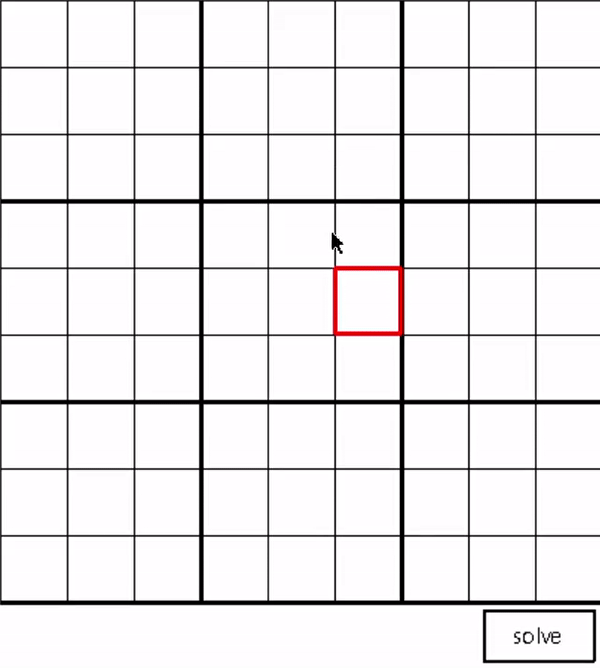
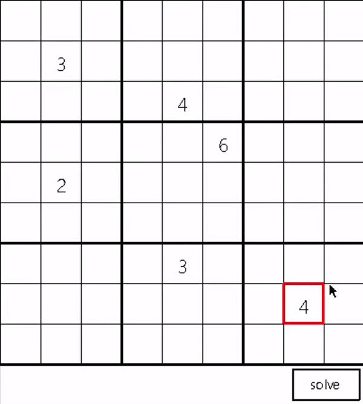

# Sudoku
This is a sudoku game you can play, or let the computer solve the board for you at any point.

## Backtracking
Generally the code for solving the sudoku works with backtracking.

## Efficiency
Simple, though efficient (Writing the algorithms for the methods of the game was a question in 
an exam I had, where all the game methods need to be implemented in O(1), and the DS needs to be
initialized in O(n^2)).

Note: obviously the solving method isn't efficient, I just wanted to experiment with backtracking..  
I might add a more elegant solution in the future.

## Credits
The [Tech With Tim](https://www.youtube.com/channel/UC4JX40jDee_tINbkjycV4Sg) channel gave me the idea to make this project (Though I implemented everything myself).
